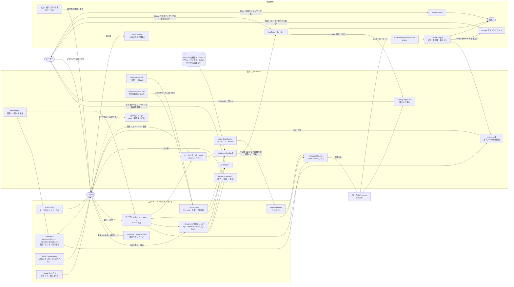
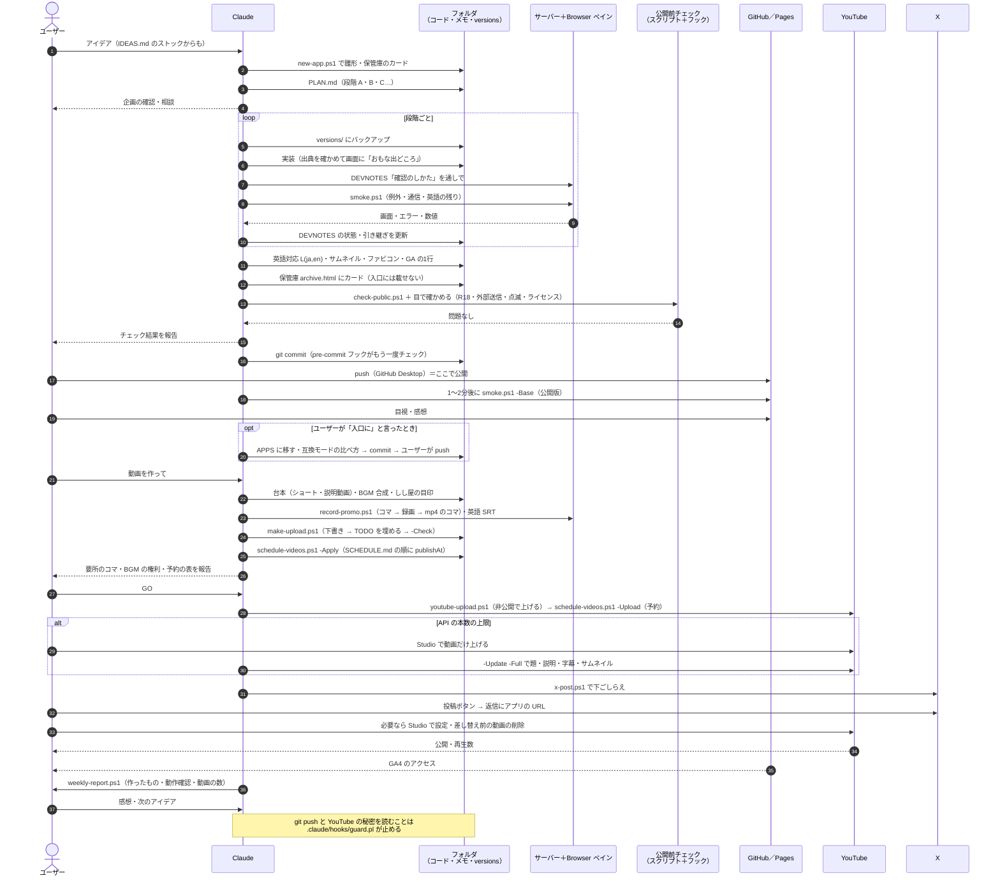

# まなびラボの作業の流れ（2026-10-10 時点）

RULES.md・_dev/promo/README.md・_dev/tools の中身から起こした図。ルールが変わったらここも直す。

## 1. データフロー図（何がどこへ流れるか）

```mermaid
flowchart LR
  U(["ユーザー"])
  C(["Claude"])

  subgraph LOCAL["この PC（アプリ開発フォルダ）"]
    IDEAS["IDEAS.md<br/>テーマのストック・好み"]
    DOCS["PLAN.md / DEVNOTES.md / RULES.md / I18N.md<br/>企画・しくみ・引き継ぎ"]
    SRC["各アプリ index.html・css・js<br/>JP/EN の文"]
    VER["versions/・launcher.html<br/>版のバックアップ"]
    THUMB["assets/thumbs/<br/>サムネイル"]
    PROMO["_dev/promo/ 台本 → out/<br/>mp4・ja/en.srt（Git に入れない）"]
    META["*.upload.json<br/>タイトル・説明・予約日時"]
    PUB["PUBLISH.local.md<br/>Artifact の URL（Git に入れない）"]
    MEM["Claude のメモリ<br/>（PC ごと・移らない）"]
  end

  subgraph TOOLS["道具（_dev/tools）"]
    SERVE["ローカルサーバー apps<br/>＋ Browser ペイン"]
    CHECK["check-public.ps1<br/>＋ pre-commit フック"]
    MKT["make-thumbs.ps1<br/>ヘッドレス Chrome"]
    YTUP["youtube-upload.ps1"]
    XP["x-post.ps1"]
    NEW["new-app.ps1<br/>雛形・一覧への追加"]
    SMOKE["smoke.ps1<br/>全アプリの動作確認"]
    REC["record-promo.ps1<br/>コマ → 録画 → 確認"]
    MKUP["make-upload.ps1<br/>下書き・-Check"]
    SCHED["schedule-videos.ps1<br/>予約日時の割りふり"]
    WEEK["weekly-report.ps1<br/>週のふり返り"]
    GUARD["guard.pl フック<br/>push・秘密を止める"]
  end

  SECRET[("YouTube の秘密・トークン<br/>プロジェクトの外・DPAPI<br/>Claude は読まない")]

  subgraph EXT["外の世界"]
    WEB["論文・資料・データ源<br/>（出どころ）"]
    GIT["GitHub sishiya/manabi-lab<br/>Public"]
    PAGES["GitHub Pages<br/>入口・保管庫・各アプリ"]
    ART["Claude Artifact<br/>（以前からの公開先）"]
    YT["YouTube「しし屋」"]
    X["X @sishiya22"]
    GA["Google アナリティクス 4"]
    VIS(["見る人"])
  end

  U -- "アイデア・感想・GO" --> C
  WEB -- "確かめた数値・出典" --> C
  IDEAS --> C
  DOCS <--> C
  MEM <--> C
  C -- "書く・直す" --> SRC
  C -- "手を入れる前・区切りごと" --> VER
  SRC --> SERVE -- "画面・コンソール・数値" --> C
  SERVE --> MKT --> THUMB
  SRC & DOCS & THUMB --> CHECK -- "問題なし" --> GITL["ローカルの commit<br/>（Claude）"]
  GITL -- "push（ユーザー）" --> GIT --> PAGES --> VIS
  C -- "再公開" --> ART
  PUB --> C
  PAGES -- "sishiya.github.io のときだけ" --> GA -- "集計（ユーザーだけ見られる）" --> U

  SRC --> PROMO
  C -- "台本を書く・録る" --> PROMO
  PROMO & META --> YTUP
  SECRET --> YTUP
  YTUP -- "非公開で上げる・英語の題/説明/CC・予約" --> YT --> VIS
  PROMO & META --> XP -- "本文をクリップボード・投稿画面を開く" --> U
  U -- "貼る・動画をドラッグ・投稿" --> X --> VIS
  U -- "Studio で手動アップ・古い動画の削除" --> YT

  C -. "すべてのツール呼び出し" .-> GUARD
  NEW --> SRC & DOCS
  SRC --> SMOKE -- "NG・注意" --> C
  PAGES --> SMOKE
  PROMO --> REC -- "コマの絵" --> C
  MKUP --> META
  SCHED -- "publishAt・入口の video" --> META
  YT -- "-Stats（読むだけ）" --> WEEK
  GITL --> WEEK -- "out/weekly-日付.md" --> U
```

## 2. シーケンス図（1本のアプリが作られて広まるまで）

```mermaid
sequenceDiagram
  autonumber
  actor U as ユーザー
  participant C as Claude
  participant L as フォルダ<br/>（コード・メモ・versions）
  participant B as サーバー＋Browser ペイン
  participant K as 公開前チェック<br/>（スクリプト＋フック）
  participant G as GitHub／Pages
  participant Y as YouTube
  participant X as X

  U->>C: アイデア（IDEAS.md のストックからも）
  C->>L: new-app.ps1 で雛形・保管庫のカード
  C->>L: PLAN.md（段階 A・B・C…）
  C-->>U: 企画の確認・相談
  loop 段階ごと
    C->>L: versions/ にバックアップ
    C->>L: 実装（出典を確かめて画面に「おもな出どころ」）
    C->>B: DEVNOTES「確認のしかた」を通しで
    C->>B: smoke.ps1（例外・通信・英語の残り）
    B-->>C: 画面・エラー・数値
    C->>L: DEVNOTES の状態・引き継ぎを更新
  end
  C->>L: 英語対応 L(ja,en)・サムネイル・ファビコン・GA の1行
  C->>L: 保管庫 archive.html にカード（入口には載せない）
  C->>K: check-public.ps1 ＋ 目で確かめる（R18・外部送信・点滅・ライセンス）
  K-->>C: 問題なし
  C-->>U: チェック結果を報告
  C->>L: git commit（pre-commit フックがもう一度チェック）
  U->>G: push（GitHub Desktop）＝ここで公開
  C->>G: 1〜2分後に smoke.ps1 -Base（公開版）
  U->>G: 目視・感想
  opt ユーザーが「入口に」と言ったとき
    C->>L: APPS に移す・互換モードの比べ方 → commit → ユーザーが push
  end

  U->>C: 動画を作って
  C->>L: 台本（ショート・説明動画）・BGM 合成・しし屋の目印
  C->>B: record-promo.ps1（コマ → 録画 → mp4 のコマ）・英語 SRT
  C->>L: make-upload.ps1（下書き → TODO を埋める → -Check）
  C->>L: schedule-videos.ps1 -Apply（SCHEDULE.md の順に publishAt）
  C-->>U: 要所のコマ・BGM の権利・予約の表を報告
  U->>C: GO
  C->>Y: youtube-upload.ps1（非公開で上げる）→ schedule-videos.ps1 -Upload（予約）
  alt API の本数の上限
    U->>Y: Studio で動画だけ上げる
    C->>Y: -Update -Full で題・説明・字幕・サムネイル
  end
  C->>X: x-post.ps1 で下ごしらえ
  U->>X: 投稿ボタン → 返信にアプリの URL
  U->>Y: 必要なら Studio で設定・差し替え前の動画の削除
  Y-->>U: 公開・再生数
  G-->>U: GA4 のアクセス
  C->>U: weekly-report.ps1（作ったもの・動作確認・動画の数）
  U->>C: 感想・次のアイデア
  Note over C,L: git push と YouTube の秘密を読むことは<br/>.claude/hooks/guard.pl が止める
```
